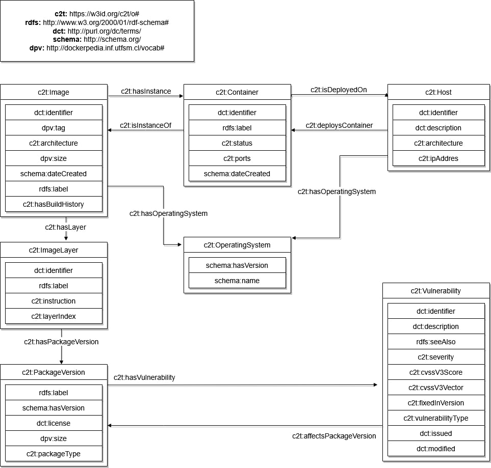

# C2T

**Context:** This project is developed as a **Bachelor's Thesis (TFG)**. It acts as an extension of the original [c2t tool](https://github.com/osoc-es/c2t), adding capabilities for monitoring containers deployed on a host, performing vulnerability analysis using SBOMs, and generating forensic traceability data through Knowledge Graphs.

## Architecture and Workflow

The application follows a modular pipeline designed to extract, unify, and semantically map data from the Docker environment.

1.  **Orchestration (`src/logic.py`):**
    The system scans the host for available images and containers. It invokes external CLI tools like `docker inspect`, `docker history`, `syft`, and `grype` to generate raw data files.

2.  **Parsing (`src/inspect_parser.py`, `src/syft_parser.py`):**
    The raw outputs are processed to normalize data structures, extract relevant metadata (creation dates, architecture, ports), and clean identifiers.

3.  **Unification (`src/unifier.py`):**
    All parsed data is aggregated into a single JSON structure (`unified_data.json`). This module implements **forensic heuristics** to align physical filesystem layers (`RootFS`) with logical build instructions (`History`). It then triggers **Morph-KGC** to map this JSON into RDF Triples using the rules defined in `mappings/mapping_host.yarrrrml.yaml`.

4.  **Graph Generation (`output/docker_graph.nt`):**
    The result is an N-Triples file representing the current state of the host, including relationships between images, layers, packages, and vulnerabilities.

5.  **Querying (`src/queries.py`, `src/CLI.py`):**
    The CLI uses `rdflib` to load the graph and execute SPARQL queries to answer specific user questions (e.g., security assessments, diffs).

## System Requirements

The following tools must be installed on your system and accessible via the terminal (PATH):

*   **Docker:** Required to interact with the daemon.
*   **Syft:** Required for generating the Software Bill of Materials (SBOM).
    ```bash
    curl -sSfL https://raw.githubusercontent.com/anchore/syft/main/install.sh | sudo sh -s -- -b /usr/local/bin
    ```
*   **Grype:** Required for vulnerability scanning.
    ```bash
    curl -sSfL https://raw.githubusercontent.com/anchore/grype/main/install.sh | sudo sh -s -- -b /usr/local/bin
    ```

## Installation

Installation can be done using **Poetry** or a standard Python **virtual environment**.

### Option A: Using Poetry

1.  Clone the repository and enter the directory:
    ```bash
    git clone https://github.com/andreigrozescu/c2t-extension.git
    cd c2t
    ```

2.  Install dependencies:
    ```bash
    poetry install
    ```

3.  Activate the environment:
    ```bash
    source $(poetry env info --path)/bin/activate
    ```

### Option B: Standard Virtual Environment

1.  Clone the repository and enter the directory:
    ```bash
    git clone https://github.com/andreigrozescu/c2t-extension.git
    cd c2t
    ```

2.  Create and activate the environment:
    ```bash
    python3 -m venv c2t-env
    source c2t-env/bin/activate
    ```

3.  Install the package:
    ```bash
    pip install -e .
    ```

## Usage

### 1. Generate Graph
Analyzes the host state and generates the Knowledge Graph.

```bash
c2t process
```
By default, the tool performs an **incremental update**. It scans the Docker Host and compares it against the existing Knowledge Graph. It **only analyzes new images or containers** that are not yet present in the graph. This is the recommended mode for daily usage.

```bash
c2t process --force
```
The `--force` flag completely discards the existing graph and re-analyzes all images and containers currently present on the host.

### 2. List Containers
Lists all containers found in the graph, including their ID, Status, and mapped Ports.

```bash
c2t list
```

**Filter Active Containers:**
You can use the `--running` flag to filter the output and show only active containers.
```bash
c2t list --running
```

### 3. Assess Vulnerabilities
Performs a security audit on a specific container or image. It displays metadata and a list of package vulnerabilities grouped by severity.

**Note:** Options must be placed **after** the target name.

```bash
c2t assess <TARGET> [OPTIONS]
```

**Options:**
*   `--filter`: Shows only **HIGH** and **CRITICAL** vulnerabilities.
*   `--fixable`: Shows only vulnerabilities with a fix available.

**Example:**
```bash
c2t assess nginx:latest --filter --fixable
```

### 4. Top Risks
Shows a ranking of the most dangerous images and containers based on the count of critical and high vulnerabilities.

```bash
c2t top-risks
```

### 5. Vulnerability Details
Shows comprehensive information about a specific vulnerability ID, including CVSS score, vector, and description. Supports CVE, GHSA, RHSA, etc.

```bash
c2t vuln <VULN_ID>
```
**Example:**
```bash
c2t vuln CVE-2021-44228
```

### 6. Audit Package Versions
Audits a specific package across the entire infrastructure. It groups the results by version, allowing you to easily identify which versions installed in your environment are safe and which are vulnerable.

```bash
c2t check-pkg <PACKAGE_NAME>
```
**Example:**
```bash
c2t check-pkg musl
```

### 7. Layer Forensics
Performs a forensic analysis of an image's layers. It correlates the physical layers with the build history to show **exactly which command** (RUN, COPY, ADD) created each layer, its size, and how many packages or vulnerabilities were introduced in that specific step.

```bash
c2t layers <IMAGE_NAME>
```
**Example:**
```bash
c2t layers my-web-app:latest
```

### 8. Image Comparison
Compares two images side-by-side. It displays:
1.  **Main Comparison:** Metadata (OS, Size, Date) and Total Vulnerability count.
2.  **Package Comparison:** A table comparing package versions (Green=Match, Yellow=Version Change, Red=Missing).

```bash
c2t diff <IMAGE_1> <IMAGE_2>
```
**Example:**
```bash
c2t diff redis:6.2-alpine redis:7.2-alpine
```

### 9. Find Containers With Package
Finds which **deployed containers** depend on a specific package. Useful for incident response (e.g., checking if `openssl` is running in production).

```bash
c2t containers-with <PACKAGE_NAME>
```
**Example:**
```bash
c2t containers-with openssl
```

### 10. Find Images With Package
Finds which **images** in the local catalog contain a specific **software package**. Useful for inventory management.

```bash
c2t images-with <PACKAGE_NAME>
```
**Example:**
```bash
c2t images-with python
```

### 11. Metadata
Retrieves metadata for all images and shows the reconstructed **Build History** (Dockerfile commands) extracted from the image layers.
```bash
c2t metadata
```

### 12. Operating System Report
Generates a summary of the Operating System families detected in the local registry.
```bash
c2t report-os
```

### 13. Show Packages (SBOM)
Generates the SBOM and lists all installed **system and application packages** for a specific image.
```bash
c2t show-pkgs <IMAGE_NAME>
```

## Ontology Model

The following diagram represents the semantic model (Ontology) used to structure the knowledge graph. It defines the relationships between the Host, Containers, Images, Layers, Packages, and Vulnerabilities.

